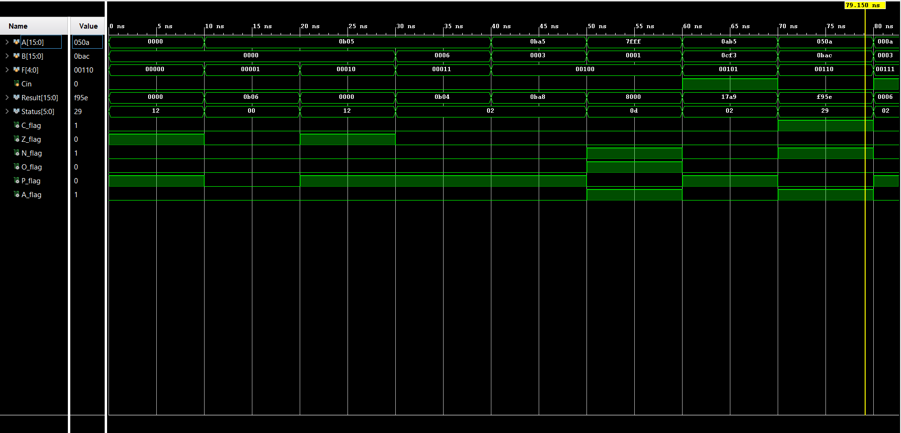
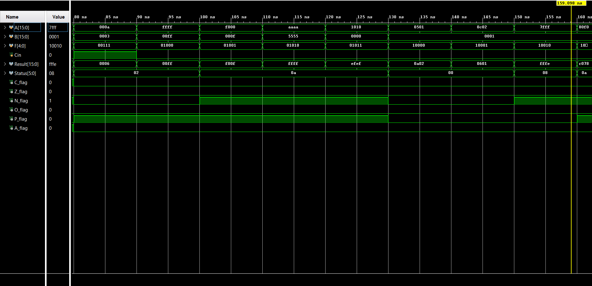
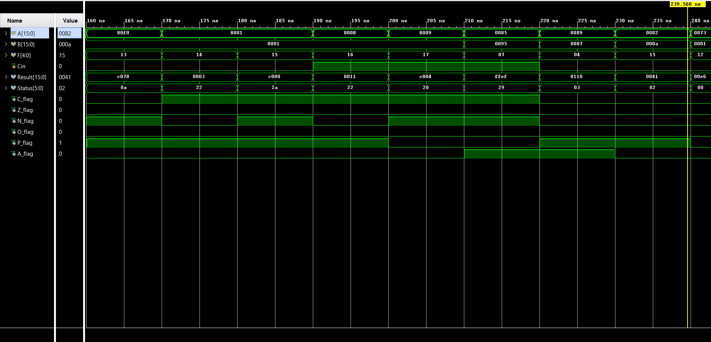
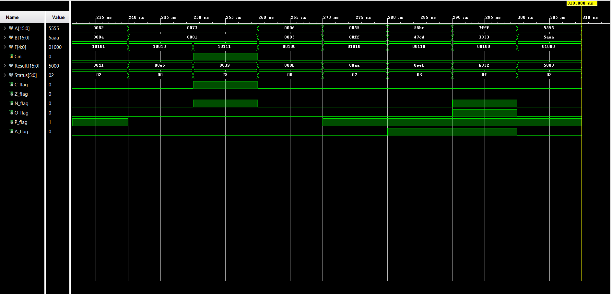

# 16-Bit Arithmetic Logic Unit (ALU) Design

**Course:** Digital Logic Design / Computer Architecture
**Language:** Verilog HDL
**Type:** Combinational Logic

## Project Overview
[cite_start]This project implements a fully combinational **16-bit Arithmetic Logic Unit (ALU)** capable of performing **20 distinct operations**, including arithmetic, bitwise logic, and complex shift/rotate functions[cite: 3503]. The design features a comprehensive 6-bit **Status Register** to support signed/unsigned arithmetic and conditional branching.

## Architecture Specifications

### I/O Ports
| Port | Direction | Width | Description |
| :--- | :--- | :--- | :--- |
| **A** | Input | 16-bit | Operand 1 |
| **B** | Input | 16-bit | Operand 2 |
| **F** | Input | 5-bit | Function Select (Opcode) |
| **Cin** | Input | 1-bit | Carry Input (for ADC/SBB/Rotate) |
| **Result** | Output | 16-bit | Operation Result |
| **Status** | Output | 6-bit | Status Flags Vector [C, Z, N, V, P, A] |

### Status Flags
[cite_start]The ALU generates six status flags calculated immediately after propagation delay [cite: 3528-3560]:

* **C (Carry):** Carry-out from MSB or borrow indication.
* **Z (Zero):** Set high if the entire 16-bit result is zero.
* **N (Negative):** Reflects the MSB (Bit 15) for signed arithmetic.
* **V (Overflow):** Indicates signed overflow (e.g., adding two positive numbers yields a negative).
* **P (Parity):** Even parity flag (XNOR reduction of result).
* **A (Auxiliary Carry):** Carry-out from the lower nibble (Bit 3), used for BCD arithmetic.

## Supported Operations (Opcode Table)

[cite_start]The ALU supports 20 operations controlled by the 5-bit input `F` [cite: 4177-4178].

| Opcode | Mnemonic | Function |
| :--- | :--- | :--- |
| **Arithmetic** | | |
| `00001` | **INC** | Increment A ($A + 1$) |
| `00011` | **DEC** | Decrement A ($A - 1$) |
| `00100` | **ADD** | Addition ($A + B$) |
| `00101` | **ADC** | Add with Carry ($A + B + C_{in}$) |
| `00110` | **SUB** | Subtraction ($A - B$) |
| `00111` | **SBB** | Subtract with Borrow ($A - B - C_{in}$) |
| **Logic** | | |
| `01000` | **AND** | Bitwise AND |
| `01001` | **OR** | Bitwise OR |
| `01010` | **XOR** | Bitwise XOR |
| `01011` | **NOT** | Bitwise NOT ($~A$) |
| **Shift / Rotate** | | |
| `10000` | **SHL** | Shift Left Logical |
| `10001` | **SHR** | Shift Right Logical |
| `10010` | **SAL** | Shift Left Arithmetic |
| `10011` | **SAR** | Shift Right Arithmetic (Sign Extension) |
| `10100` | **ROL** | Rotate Left |
| `10101` | **ROR** | Rotate Right |
| `10110` | **RCL** | Rotate Through Carry Left |
| `10111` | **RCR** | Rotate Through Carry Right |

## Simulation Results
The design was verified using a comprehensive testbench covering corner cases (Overflow, Carry, Zero) and random vectors.


*Figure 1: Simulation of Arithmetic Operations (ADD, SUB, INC, DEC).*


*Figure 2: Simulation of Logic Operations (AND, OR, XOR, NOT).*


*Figure 3: Simulation of Shift Operations (SHL, SHR, SAL, SAR, ROL, ROR, RCL, RCR).*


*Figure 4: Simulation of all Operations.*


## How to Run
1.  Clone the repository:
    ```bash
    git clone [https://github.com/a7med57/16-Bit-ALU-.git](https://github.com/a7med57/16-Bit-ALU-.git)
    ```
2.  Open the project in **Vivado**, **ModelSim**, or **EDA Playground**.
3.  Compile `16-Bit-ALU/src/ALU.v` and `16-Bit-ALU/src/alu_tb.v`.
4.  Run the simulation to view waveforms.
